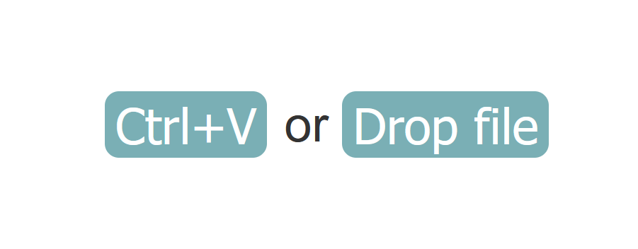
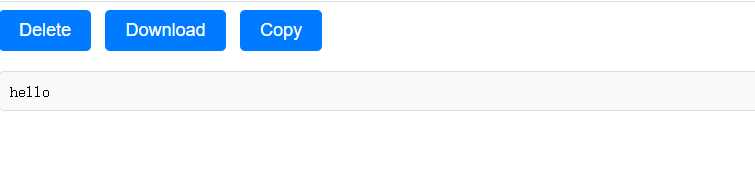

# web-clipboard
简洁的网页剪切板，方便不同设备分享剪切板或文件

## 安装
### shell
点此下载[Release](https://github.com/0990/web-clipboard/releases)，启动即可<br>
```
./webclipboard
```
### [docker安装](doc/docker.md)
## 使用
访问 127.0.0.1,拖入文件或ctrl+V,即可上传文件或剪切板<br>
<br>
再次访问127.0.0.1,即可查看剪切板内容<br>


## 命令行操作
### 上传文件
```bash
curl -F "file==@myfile.txt" 127.0.0.1
```
或
```bash
curl --upload-file myfile.txt 127.0.0.1
```
### 删除文件
```bash
curl -X DELETE 127.0.0.1
```

### 下载文件
```bash
curl -OJ 127.0.0.1
```